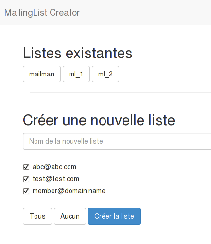

MLCreator
====

Simple web frontend to create new mailing-lists on a mailman instance.

It retrieves users from a 'main' mailing-list to copy these users to newly created mailing-lists.

Go!
===

Download and run mlcreator:

    git clone https://github.com/alx/mlcreator
    
    cd mlcreator
    bundle install                  # To install gems
    
    cp config/config.yml.sample config/config.yml # Edit your configuration before running the tool
    
    bundle exec ruby app.rb         # To run the tool
	
Then open [http://localhost:4567/](http://localhost:4567/)
